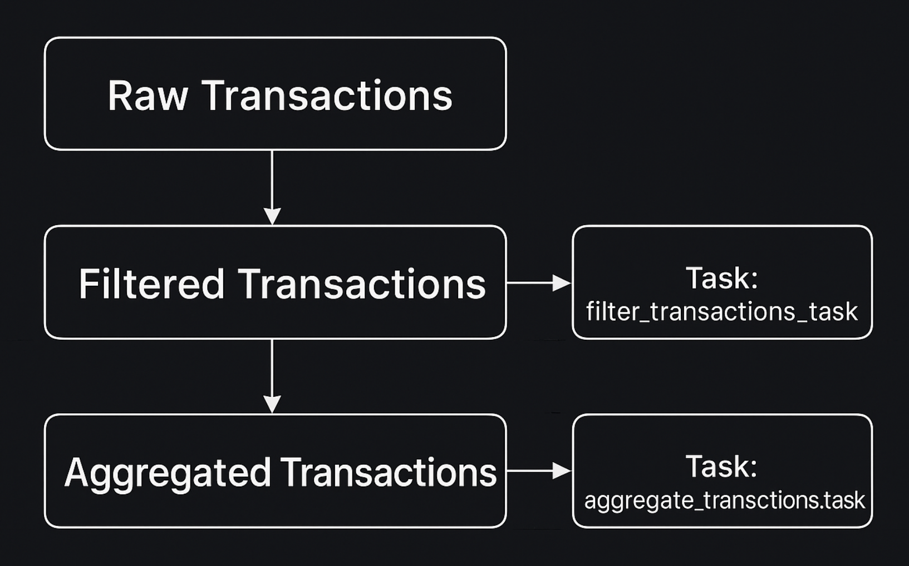

# Snowflake ETL Pipeline with Tasks

This project demonstrates how to build a simple **ETL pipeline in Snowflake** using **tables, scheduled tasks, and merges**.
It simulates raw transaction ingestion, filtering, and daily aggregation.


## 📌 Project Overview

We define **three tables** and **two tasks**:

* **`raw_transactions`** → staging table where all incoming records land.
* **`filtered_transactions`** → keeps only valid transactions (`completed` and `refunded`).
* **`aggregated_transactions`** → daily rollup of total quantities and transaction counts.
* **`filter_transactions_task`** → scheduled job that filters and merges into `filtered_transactions`.
* **`aggregate_transactions_task`** → runs after Task 1 and aggregates daily data.



---

## 🛠️ SQL Code with Explanations

### 1. Create Raw Transactions Table

This is the staging table for all incoming data.

```sql
CREATE OR REPLACE TABLE raw_transactions (
    transaction_id INT,
    customer_id INT,
    product_id INT,
    quantity INT,
    transaction_date TIMESTAMP,
    transaction_status VARCHAR
);
```

### 2. Insert Sample Data

We simulate some incoming transactions with different statuses.

```sql
-- Insert this data in raw_transactions after scheduling tasks
INSERT INTO raw_transactions VALUES
(4, 104, 1004, 3, '2024-12-02 09:30:00', 'completed'),
(5, 105, 1005, 1, '2024-12-02 10:45:00', 'pending'),
(6, 106, 1006, 4, '2024-12-02 11:15:00', 'completed');

INSERT INTO raw_transactions VALUES
(7, 107, 1007, 2, '2024-12-03 08:00:00', 'completed'),
(8, 108, 1008, 1, '2024-12-03 09:30:00', 'canceled'),
(9, 109, 1009, 3, '2024-12-03 10:45:00', 'completed');

INSERT INTO raw_transactions VALUES
(10, 107, 1007, 2, '2024-12-03 08:00:00', 'completed'),
(11, 108, 1008, 1, '2024-12-03 09:30:00', 'canceled'),
(12, 109, 1009, 3, '2024-12-03 10:45:00', 'completed');
```

---

### 3. Create Filtered Transactions Table

Stores only valid transactions.

```sql
CREATE OR REPLACE TABLE filtered_transactions (
    transaction_id INT,
    product_id INT,
    quantity INT,
    transaction_date DATE,
    transaction_status VARCHAR
);
```

---

### 4. Create Aggregated Transactions Table

Rolls up data daily for reporting.

```sql
CREATE OR REPLACE TABLE aggregated_transactions (
    transaction_date DATE,
    total_quantity INT,
    completed_transactions INT,
    refunded_transactions INT
);
```

---

### 5. Task 1: Filtering Transactions

Runs every **1 minute** and merges qualifying transactions into `filtered_transactions`.

```sql
CREATE OR REPLACE TASK filter_transactions_task
WAREHOUSE = compute_wh
SCHEDULE = '1 MINUTES'
AS
MERGE INTO filtered_transactions tgt
USING (
    SELECT 
        transaction_id,
        product_id,
        quantity,
        DATE(transaction_date) AS transaction_date,
        transaction_status
    FROM raw_transactions
    WHERE transaction_status IN ('completed', 'refunded')
) src
ON tgt.transaction_id = src.transaction_id
WHEN MATCHED THEN UPDATE SET
    tgt.product_id = src.product_id,
    tgt.quantity = src.quantity,
    tgt.transaction_date = src.transaction_date,
    tgt.transaction_status = src.transaction_status
WHEN NOT MATCHED THEN INSERT (
    transaction_id, product_id, quantity, transaction_date, transaction_status
) VALUES (
    src.transaction_id, src.product_id, src.quantity, src.transaction_date, src.transaction_status
);
```

---

### 6. Task 2: Aggregating Transactions

Runs **after Task 1** completes. Performs daily rollups.

```sql
CREATE OR REPLACE TASK aggregate_transactions_task
WAREHOUSE = COMPUTE_WH
AFTER filter_transactions_task -- Set dependency on Task 1
AS
MERGE INTO aggregated_transactions tgt
USING (
    SELECT 
        transaction_date,
        SUM(quantity) AS total_quantity,
        COUNT_IF(transaction_status = 'completed') AS completed_transactions,
        COUNT_IF(transaction_status = 'refunded') AS refunded_transactions
    FROM filtered_transactions
    GROUP BY transaction_date
) src
ON tgt.transaction_date = src.transaction_date
WHEN MATCHED THEN UPDATE SET
    tgt.total_quantity = src.total_quantity,
    tgt.completed_transactions = src.completed_transactions,
    tgt.refunded_transactions = src.refunded_transactions
WHEN NOT MATCHED THEN INSERT (
    transaction_date, total_quantity, completed_transactions, refunded_transactions
) VALUES (
    src.transaction_date, src.total_quantity, src.completed_transactions, src.refunded_transactions
);
```

---

### 7. Control Tasks (Start/Stop)

Tasks are **created in suspended mode by default**. Resume them to start execution.

```sql
ALTER TASK aggregate_transactions_task RESUME;
ALTER TASK filter_transactions_task RESUME;

-- To stop them
ALTER TASK filter_transactions_task SUSPEND;
ALTER TASK aggregate_transactions_task SUSPEND;
```

---

### 8. Monitor Task Execution

Check history of runs.

```sql
-- History of filter task
SELECT * FROM TABLE(INFORMATION_SCHEMA.TASK_HISTORY(TASK_NAME=>'filter_transactions_task'))
ORDER BY SCHEDULED_TIME;

-- History of aggregate task
SELECT * FROM TABLE(INFORMATION_SCHEMA.TASK_HISTORY(TASK_NAME=>'aggregate_transactions_task'))
ORDER BY SCHEDULED_TIME;
```

---

### 9. Query the Results

```sql
-- Inspect filtered transactions
SELECT * FROM filtered_transactions;
SELECT COUNT(*) FROM filtered_transactions;

-- Inspect aggregated transactions
SELECT * FROM aggregated_transactions;
```

---

## 📊 Pipeline Flow


---

## 🚀 Key Features

* End-to-end ETL with **Snowflake Tasks**
* **Incremental merge logic** ensures no duplicates
* **Chained tasks** (aggregation waits for filtering)
* Monitoring via `TASK_HISTORY`

---
